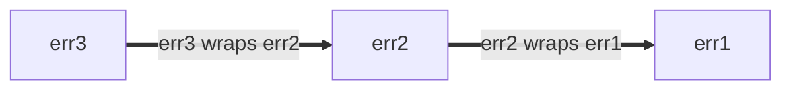

# Go Style Best Practices

> **Примечание:** Это часть серии документов, описывающих [Go Style](https://google.github.io/index) в Google. Этот документ не является [нормативным](https://google.github.io/index#normative) или [каноническим](https://google.github.io/index#canonical) и является вспомогательным документом к [основному руководству по стилю](https://google.github.io/guide). См. [обзор](https://google.github.io/index#about) для получения дополнительной информации.

## О документе

Этот файл содержит рекомендации о том, как лучше применять Go Style Guide. Эти рекомендации предназначены для распространённых ситуаций, которые возникают часто, но могут не применяться в любых обстоятельствах. Где это возможно, обсуждаются несколько альтернативных подходов вместе с соображениями, которые учитываются при принятии решения о том, когда и когда не следует их применять. См. [обзор](https://google.github.io/index#about) для полного набора документов по стилю.

## Именование

### Имена функций и методов

#### Избегайте повторений

При выборе имени для функции или метода учитывайте контекст, в котором это имя будет читаться. Рассмотрите следующие рекомендации, чтобы избежать излишнего [повторения](https://google.github.io/decisions#repetition) в месте вызова:

Как правило, из имён функций и методов можно опустить:

- Типы входных и выходных параметров (когда нет коллизии)
- Тип получателя метода
- Является ли входной или выходной параметр указателем

Для функций не [повторяйте имя пакета](https://google.github.io/decisions#repetitive-with-package).

```go
// Плохо:
package yamlconfig

func ParseYAMLConfig(input string) (*Config, error)

// Хорошо:
package yamlconfig

func Parse(input string) (*Config, error)
```

Для методов не повторяйте имя получателя метода.

```go
// Плохо:
func (c *Config) WriteConfigTo(w io.Writer) (int64, error)

// Хорошо:
func (c *Config) WriteTo(w io.Writer) (int64, error)
```

Не повторяйте имена переменных, переданных в качестве параметров.

```go
// Плохо:
func OverrideFirstWithSecond(dest, source *Config) error

// Хорошо:
func Override(dest, source *Config) error
```

Не повторяйте имена и типы возвращаемых значений.

```go
// Плохо:
func TransformToJSON(input *Config) *jsonconfig.Config

// Хорошо:
func Transform(input *Config) *jsonconfig.Config
```

Когда необходимо устранить неоднозначность функций с похожими именами, допустимо включить дополнительную информацию.

```go
// Хорошо:
func (c *Config) WriteTextTo(w io.Writer) (int64, error)
func (c *Config) WriteBinaryTo(w io.Writer) (int64, error)
```

#### Соглашения об именовании

Существуют и другие распространённые соглашения при выборе имён для функций и методов:

Функции, которые что-то возвращают, получают имена, похожие на существительные.

```go
// Хорошо:
func (c *Config) JobName(key string) (value string, ok bool)
```

Следствие этого — имена функций и методов должны [избегать префикса Get](https://google.github.io/decisions#getters).

```go
// Плохо:
func (c *Config) GetJobName(key string) (value string, ok bool)
```

Функции, которые что-то делают, получают имена, похожие на глаголы.

```go
// Хорошо:
func (c *Config) WriteDetail(w io.Writer) (int64, error)
```

Идентичные функции, различающиеся только типами, включают имя типа в конец имени.

```go
// Хорошо:
func ParseInt(input string) (int, error)
func ParseInt64(input string) (int64, error)
func AppendInt(buf []byte, value int) []byte
func AppendInt64(buf []byte, value int64) []byte
```

Если есть очевидная «основная» версия, тип можно опустить в имени для этой версии:

```go
// Хорошо:
func (c *Config) Marshal() ([]byte, error)
func (c *Config) MarshalText() (string, error)
```

### Пакеты для тестовых двойников и вспомогательных функций

Существует несколько подходов к [именованию](https://google.github.io/guide#naming) пакетов и типов, предоставляющих тестовые вспомогательные функции и особенно [тестовые двойники](https://abseil.io/resources/swe-book/html/ch13.html#basic_concepts). Тестовый двойник может быть заглушкой (stub), фейком (fake), моком (mock) или шпионом (spy). В этих примерах в основном используются заглушки. Обновляйте имена соответствующим образом, если ваш код использует фейки или другой вид тестового двойника.

Предположим, у вас есть хорошо сфокусированный пакет, предоставляющий производственный код, подобный этому:

```go
package creditcard

import (
    "errors"
    "path/to/money"
)

// ErrDeclined указывает, что эмитент отклоняет списание.
var ErrDeclined = errors.New("creditcard: declined")

// Card содержит информацию о кредитной карте, такую как эмитент,
// срок действия и лимит.
type Card struct {
    // опущено
}

// Service позволяет выполнять операции с кредитными картами через внешних
// поставщиков платежей, такие как charge, authorize, reimburse и subscribe.
type Service struct {
    // опущено
}

func (s *Service) Charge(c *Card, amount money.Money) error { /* опущено */ }
```

#### Создание пакетов для тестовых вспомогательных функций

Предположим, вы хотите создать пакет, содержащий тестовые двойники для другого пакета. Мы будем использовать `package creditcard` (из вышеприведённого) для этого примера:

Один из подходов — создать новый Go-пакет на основе производственного для тестирования. Безопасный выбор — добавить слово `test` к исходному имени пакета («creditcard» + «test»):

```go
// Хорошо:
package creditcardtest
```

Если явно не указано иное, все примеры в разделах ниже находятся в `package creditcardtest`.

#### Простой случай

Вы хотите добавить набор тестовых двойников для `Service`. Поскольку `Card` фактически является простым типом данных, похожим на сообщение Protocol Buffer, он не требует специальной обработки в тестах, поэтому двойник не нужен. Если вы ожидаете только тестовые двойники для одного типа (например, `Service`), вы можете использовать краткий подход к именованию двойников:

```go
// Хорошо:
import (
    "path/to/creditcard"
    "path/to/money"
)

// Stub заглушает creditcard.Service и не предоставляет собственного поведения.
type Stub struct{}

func (Stub) Charge(*creditcard.Card, money.Money) error { return nil }
```

Это строго предпочтительнее, чем выбор имени, подобный `StubService` или очень плохой `StubCreditCardService`, потому что базовое имя пакета и его доменные типы подразумевают, что такое `creditcardtest.Stub`.

Наконец, если пакет собирается с помощью Bazel, убедитесь, что новое правило `go_library` для пакета помечено как `testonly`:

```python
# Хорошо:
go_library(
    name = "creditcardtest",
    srcs = ["creditcardtest.go"],
    deps = [
        ":creditcard",
        ":money",
    ],
    testonly = True,
)
```

Вышеописанный подход является общепринятым и будет достаточно хорошо понят другими инженерами.

См. также:

#### Множественное поведение тестовых двойников

Когда одного вида заглушки недостаточно (например, вам также нужна та, которая всегда завершается ошибкой), мы рекомендуем называть заглушки в соответствии с поведением, которое они эмулируют. Здесь мы переименовываем `Stub` в `AlwaysCharges` и вводим новую заглушку под названием `AlwaysDeclines`:

```go
// Хорошо:
// AlwaysCharges заглушает creditcard.Service и имитирует успех.
type AlwaysCharges struct{}

func (AlwaysCharges) Charge(*creditcard.Card, money.Money) error { return nil }

// AlwaysDeclines заглушает creditcard.Service и имитирует отклонённые
// списания.
type AlwaysDeclines struct{}

func (AlwaysDeclines) Charge(*creditcard.Card, money.Money) error {
    return creditcard.ErrDeclined
}
```

#### Множественные двойники для множественных типов

Но теперь предположим, что `package creditcard` содержит несколько типов, для которых стоит создавать двойники, как показано ниже с `Service` и `StoredValue`:

```go
package creditcard

type Service struct {
    // опущено
}

type Card struct {
    // опущено
}

// StoredValue управляет кредитными балансами клиентов. Это применяется, когда
// возвращённый товар зачисляется на местный счёт клиента вместо обработки
// эмитентом кредита. По этой причине он реализован как отдельный сервис.
type StoredValue struct {
    // опущено
}

func (s *StoredValue) Credit(c *Card, amount money.Money) error { /* опущено */ }
```

В этом случае более явное именование тестовых двойников имеет смысл:

```go
// Хорошо:
type StubService struct{}

func (StubService) Charge(*creditcard.Card, money.Money) error { return nil }

type StubStoredValue struct{}

func (StubStoredValue) Credit(*creditcard.Card, money.Money) error { return nil }
```

#### Локальные переменные в тестах

Когда переменные в ваших тестах ссылаются на двойники, выбирайте имя, которое наиболее чётко отличает двойник от других производственных типов, основываясь на контексте. Рассмотрим некоторый производственный код, который вы хотите протестировать:

```go
package payment

import (
    "path/to/creditcard"
    "path/to/money"
)

type CreditCard interface {
    Charge(*creditcard.Card, money.Money) error
}

type Processor struct {
    CC CreditCard
}

var ErrBadInstrument = errors.New("payment: instrument is invalid or expired")

func (p *Processor) Process(c *creditcard.Card, amount money.Money) error {
    if c.Expired() {
        return ErrBadInstrument
    }
    return p.CC.Charge(c, amount)
}
```

В тестах тестовый двойник, называемый «шпионом» для `CreditCard`, сопоставляется с производственными типами, поэтому добавление префикса к имени может улучшить ясность.

```go
// Хорошо:
package payment

import "path/to/creditcardtest"

func TestProcessor(t *testing.T) {
    var spyCC creditcardtest.Spy
    proc := &Processor{CC: spyCC}

    // объявления опущены: card и amount
    if err := proc.Process(card, amount); err != nil {
        t.Errorf("proc.Process(card, amount) = %v, want nil", err)
    }

    charges := []creditcardtest.Charge{
        {Card: card, Amount: amount},
    }

    if got, want := spyCC.Charges, charges; !cmp.Equal(got, want) {
        t.Errorf("spyCC.Charges = %v, want %v", got, want)
    }
}
```

Это понятнее, чем когда имя не имеет префикса.

```go
// Плохо:
package payment

import "path/to/creditcardtest"

func TestProcessor(t *testing.T) {
    var cc creditcardtest.Spy
    proc := &Processor{CC: cc}

    // объявления опущены: card и amount
    if err := proc.Process(card, amount); err != nil {
        t.Errorf("proc.Process(card, amount) = %v, want nil", err)
    }

    charges := []creditcardtest.Charge{
        {Card: card, Amount: amount},
    }

    if got, want := cc.Charges, charges; !cmp.Equal(got, want) {
        t.Errorf("cc.Charges = %v, want %v", got, want)
    }
}
```

### Затенение (Shadowing)

> **Примечание:** В этом объяснении используются два неформальных термина: *stomping* и *shadowing*. Они не являются официальными концепциями в спецификации языка Go.

Как и многие языки программирования, Go имеет изменяемые переменные: присваивание переменной изменяет её значение.

```go
// Хорошо:
func abs(i int) int {
    if i < 0 {
        i *= -1
    }
    return i
}
```

При использовании [кратких объявлений переменных](https://go.dev/ref/spec#Short_variable_declarations) с оператором `:=` в некоторых случаях новая переменная не создаётся. Мы можем назвать это *stomping*. Это нормально делать, когда исходное значение больше не нужно.

```go
// Хорошо:
// innerHandler — вспомогательная функция для некоторого обработчика запросов, который сам
// отправляет запросы к другим бэкендам.
func (s *Server) innerHandler(ctx context.Context, req *pb.MyRequest) *pb.MyResponse {
    // Безусловно ограничиваем дедлайн для этой части обработки запроса.
    ctx, cancel := context.WithTimeout(ctx, 3*time.Second)
    defer cancel()
    ctxlog.Info(ctx, "Capped deadline in inner request")

    // Код здесь больше не имеет доступа к исходному контексту.
    // Это хороший стиль, если при первом написании вы предполагаете,
    // что даже по мере роста кода ни одна операция не должна
    // законно использовать (возможно, неограниченный) исходный контекст,
    // предоставленный вызывающей стороной.
    // ...
}
```

Однако будьте осторожны с использованием кратких объявлений переменных в новой области видимости: это создаёт новую переменную. Мы можем назвать это *затенением* исходной переменной. Код после конца блока ссылается на исходную переменную. Вот ошибочная попытка условно сократить дедлайн:

```go
// Плохо:
func (s *Server) innerHandler(ctx context.Context, req *pb.MyRequest) *pb.MyResponse {
    // Попытка условно ограничить дедлайн.
    if *shortenDeadlines {
        ctx, cancel := context.WithTimeout(ctx, 3*time.Second)
        defer cancel()
        ctxlog.Info(ctx, "Capped deadline in inner request")
    }

    // ОШИБКА: здесь "ctx" снова означает контекст, предоставленный вызывающей стороной.
    // Приведённый выше ошибочный код скомпилировался, потому что и ctx, и
    // cancel использовались внутри оператора if.
    // ...
}
```

Правильная версия кода может быть такой:

```go
// Хорошо:
func (s *Server) innerHandler(ctx context.Context, req *pb.MyRequest) *pb.MyResponse {
    if *shortenDeadlines {
        var cancel func()
        // Обратите внимание на использование простого присваивания, =, а не :=.
        ctx, cancel = context.WithTimeout(ctx, 3*time.Second)
        defer cancel()
        ctxlog.Info(ctx, "Capped deadline in inner request")
    }
    // ...
}
```

В случае, который мы назвали *stomping*, поскольку новой переменной нет, тип присваиваемого значения должен совпадать с типом исходной переменной. При *затенении* вводится совершенно новая сущность, поэтому она может иметь другой тип. Преднамеренное затенение может быть полезной практикой, но вы всегда можете использовать новое имя, если это улучшает [ясность](https://google.github.io/guide#clarity).

Не рекомендуется использовать переменные с теми же именами, что и стандартные пакеты, кроме очень маленьких областей видимости, потому что это делает свободные функции и значения из этого пакета недоступными.

И наоборот, при выборе имени для вашего пакета избегайте имён, которые, вероятно, потребуют [переименования импорта](https://google.github.io/decisions#import-renaming) или вызовут затенение в остальном хороших имён переменных на стороне клиента.

```go
// Плохо:
func LongFunction() {
    url := "https://example.com/"
    // Ой, теперь мы не можем использовать net/url в коде ниже.
}
```

### Пакеты Util

Go-пакеты имеют имя, указанное в объявлении `package`, отдельно от пути импорта. Имя пакета важнее для читаемости, чем путь. Имена Go-пакетов должны быть [связаны с тем, что предоставляет пакет](https://google.github.io/decisions#package-names).

Называть пакет просто `util`, `helper`, `common` или подобным — обычно плохой выбор (хотя это может быть частью имени). Неинформативные имена затрудняют чтение кода, и при слишком широком использовании они могут привести к ненужным [конфликтам импорта](https://google.github.io/decisions#import-renaming).

Вместо этого подумайте, как будет выглядеть место вызова.

```go
// Хорошо:
db := spannertest.NewDatabaseFromFile(...)
_, err := f.Seek(0, io.SeekStart)
b := elliptic.Marshal(curve, x, y)
```

Вы можете примерно понять, что делает каждый из них, даже не зная списка импортов (`cloud.google.com/go/spanner/spannertest`, `io` и `crypto/elliptic`). С менее сфокусированными именами они могли бы читаться так:

```go
// Плохо:
db := test.NewDatabaseFromFile(...)
_, err := f.Seek(0, common.SeekStart)
b := helper.Marshal(curve, x, y)
```

## Размер пакета

Если вы спрашиваете себя, насколько большими должны быть ваши Go-пакеты и следует ли размещать связанные типы в одном пакете или разделять их на разные, хорошей отправной точкой является [пост в блоге Go об именах пакетов](https://go.dev/blog/package-names). Несмотря на заголовок поста, он не только об именовании. Он содержит несколько полезных подсказок и ссылается на несколько полезных статей и докладов.

Вот некоторые другие соображения и заметки. Пользователи видят [godoc](https://pkg.go.dev/) для пакета на одной странице, и любые методы, экспортируемые типами, предоставляемыми пакетом, группируются по их типу. Godoc также группирует конструкторы вместе с типами, которые они возвращают.

Если клиентскому коду, вероятно, потребуются два значения разных типов для взаимодействия друг с другом, может быть удобно для пользователя иметь их в одном пакете.

Код внутри пакета может получать доступ к неэкспортированным идентификаторам в пакете. Если у вас есть несколько связанных типов, реализация которых тесно связана, размещение их в одном пакете позволяет достичь этой связи, не загрязняя публичный API этими деталями. Хороший тест на эту связь — представить гипотетического пользователя двух пакетов, где пакеты охватывают близкие темы: если пользователь должен импортировать оба пакета, чтобы использовать любой из них каким-либо осмысленным образом, объединение их вместе обычно является правильным решением. Стандартная библиотека в целом хорошо демонстрирует такой подход к области видимости и слоям.

При всём этом, размещение всего вашего проекта в одном пакете, вероятно, сделает этот пакет слишком большим. Когда что-то концептуально отличается, выделение его в собственный небольшой пакет может упростить использование. Короткое имя пакета, известное клиентам, вместе с именем экспортируемого типа работают вместе, образуя осмысленный идентификатор: например, `bytes.Buffer`, `ring.New`. [Пост в блоге Package Names](https://go.dev/blog/package-names) содержит больше примеров.

Go-стиль гибок в отношении размера файла, потому что сопровождающие могут перемещать код внутри пакета из одного файла в другой, не влияя на вызывающих. Но как общее руководство: обычно не очень хорошая идея иметь один файл с многими тысячами строк, или иметь много крошечных файлов. Не существует соглашения «один тип — один файл», как в некоторых других языках. Как правило, файлы должны быть достаточно сфокусированными, чтобы сопровождающий мог сказать, какой файл что содержит, и файлы должны быть достаточно маленькими, чтобы их было легко найти. Стандартная библиотека часто разбивает большие пакеты на несколько исходных файлов, группируя связанный код по файлам. Исходный код [package bytes](https://go.dev/src/bytes/) — хороший пример.

Пакеты с длинной документацией пакета могут выделить один файл с именем `doc.go`, содержащий [документацию пакета](https://google.github.io/decisions#package-comments), объявление пакета и ничего больше, но это не обязательно.

Внутри кодовой базы Google и в проектах, использующих Bazel, структура каталогов для Go-кода отличается от таковой в открытых Go-проектах: вы можете иметь несколько целей `go_library` в одном каталоге. Хорошая причина дать каждому пакету собственный каталог — если вы ожидаете открыть исходный код вашего проекта в будущем.

Несколько неканонических справочных примеров, помогающих продемонстрировать эти идеи на практике:

- **маленькие пакеты**, содержащие одну целостную идею, которая не требует ничего добавлять или удалять:
  - [package csv](https://pkg.go.dev/encoding/csv): кодирование и декодирование данных CSV с разделением ответственности соответственно между [reader.go](https://go.googlesource.com/go/+/refs/heads/master/src/encoding/csv/reader.go) и [writer.go](https://go.googlesource.com/go/+/refs/heads/master/src/encoding/csv/writer.go).
  - [package expvar](https://pkg.go.dev/expvar): телеметрия программы whitebox, вся содержится в [expvar.go](https://go.googlesource.com/go/+/refs/heads/master/src/expvar/expvar.go).

- **пакеты среднего размера**, содержащие один большой домен и несколько его обязанностей вместе:
  - package flag: управление флагами командной строки, всё содержится в flag.go.

- **большие пакеты**, разделяющие несколько близко связанных доменов по нескольким файлам:
  - package http: ядро HTTP: client.go — поддержка HTTP-клиентов; server.go — поддержка HTTP-серверов; cookie.go — управление cookie.
  - package os: кроссплатформенные абстракции операционной системы: exec.go — управление подпроцессами; file.go — управление файлами; tempfile.go — временные файлы.

- package

См. также:

## Импорты

### Сообщения Protocol Buffer и заглушки

Импорты библиотеки Proto обрабатываются иначе, чем стандартные Go-импорты, из-за их кросс-языковой природы. Соглашение для переименованных proto-импортов основано на правиле, сгенерировавшем пакет:

- Суффикс `pb` обычно используется для правил `go_proto_library`.
- Суффикс `grpc` обычно используется для правил `go_grpc_library`.

Часто используется одно слово, описывающее пакет:

```go
// Хорошо:
import (
    foopb "path/to/package/foo_service_go_proto"
    foogrpc "path/to/package/foo_service_go_grpc"
)
```

Следуйте рекомендациям по стилю для имён пакетов. Предпочитайте целые слова. Короткие имена хороши, но избегайте двусмысленности. Если сомневаетесь, используйте имя proto-пакета до `_go` с суффиксом `pb`:

```go
// Хорошо:
import (
    pushqueueservicepb "path/to/package/push_queue_service_go_proto"
)
```

**Примечание:** Предыдущие рекомендации поощряли очень короткие имена, такие как `xpb` или даже просто `pb`. Новый код должен предпочитать более описательные имена. Существующий код, использующий короткие имена, не должен использоваться в качестве примера, но не нуждается в изменении.

### Порядок импортов

## Обработка ошибок

В Go ошибки — это значения; они создаются кодом и потребляются кодом. Ошибки могут быть:

- Преобразованы в диагностическую информацию для отображения людям
- Использованы сопровождающим
- Интерпретированы конечным пользователем

Сообщения об ошибках также появляются на различных поверхностях, включая сообщения журнала, дампы ошибок и отрендеренные пользовательские интерфейсы. Код, который обрабатывает (производит или потребляет) ошибки, должен делать это осознанно. Может возникнуть соблазн игнорировать или слепо распространять возвращаемое значение ошибки. Однако всегда стоит подумать, находится ли текущая функция в кадре вызова в положении, позволяющем наиболее эффективно обработать ошибку.

Это большая тема, и трудно дать категорический совет. Используйте своё суждение, но имейте в виду следующие соображения:

- При создании значения ошибки решите, придавать ли ей какую-либо структуру.
- При обработке ошибки рассмотрите возможность добавления информации, которая есть у вас, но которой может не быть у вызывающей и/или вызываемой стороны.
- См. также рекомендации по [логированию ошибок](#logging-errors).

Хотя обычно не следует игнорировать ошибку, разумным исключением является оркестрация связанных операций, где часто полезна только первая ошибка. Пакет `errgroup` предоставляет удобную абстракцию для группы операций, которые могут все завершиться неудачей или быть отменены как группа.

См. также:

### Структура ошибок

Если вызывающим сторонам нужно исследовать ошибку (например, различать разные условия ошибки), придайте значению ошибки структуру, чтобы это можно было сделать программно, а не заставлять вызывающую сторону выполнять сопоставление строк. Этот совет применим как к производственному коду, так и к тестам, которые заботятся о различных условиях ошибки.

Простейшие структурированные ошибки — это непараметризованные глобальные значения.

```go
type Animal string

var (
    // ErrDuplicate возникает, если это животное уже было замечено.
    ErrDuplicate = errors.New("duplicate")

    // ErrMarsupial возникает, потому что у нас аллергия на сумчатых за пределами Австралии.
    // Извините.
    ErrMarsupial = errors.New("marsupials are not supported")
)

func process(animal Animal) error {
    switch {
    case seen[animal]:
        return ErrDuplicate
    case marsupial(animal):
        return ErrMarsupial
    }
    seen[animal] = true
    // ...
    return nil
}
```

Вызывающая сторона может просто сравнить возвращённое значение ошибки функции с одним из известных значений ошибки:

```go
// Хорошо:
func handlePet(...) {
    switch err := process(an); err {
    case ErrDuplicate:
        return fmt.Errorf("feed %q: %v", an, err)
    case ErrMarsupial:
        // Пытаемся восстановиться с помощью друга вместо этого.
        alternate = an.BackupAnimal()
        return handlePet(..., alternate, ...)
    }
}
```

Выше используются *sentinel*-значения, где ошибка должна быть равна (в смысле `==`) ожидаемому значению. Это вполне адекватно во многих случаях. Если `process` возвращает обёрнутые ошибки (обсуждается ниже), вы можете использовать `errors.Is`.

```go
// Хорошо:
func handlePet(...) {
    switch err := process(an); {
    case errors.Is(err, ErrDuplicate):
        return fmt.Errorf("feed %q: %v", an, err)
    case errors.Is(err, ErrMarsupial):
        // ...
    }
}
```

Не пытайтесь различать ошибки на основе их строковой формы. (См. [Go Tip #13: Designing Errors for Checking](https://google.github.io/tips/#13) для получения дополнительной информации.)

```go
// Плохо:
func handlePet(...) {
    err := process(an)
    if regexp.MatchString(`duplicate`, err.Error()) {...}
    if regexp.MatchString(`marsupial`, err.Error()) {...}
}
```

Если в ошибке есть дополнительная информация, которая нужна вызывающей стороне программно, её идеально следует представлять структурно. Например, тип `os.PathError` документирован как помещающий имя пути неудачной операции в поле структуры, к которому вызывающая сторона может легко получить доступ.

Другие структуры ошибок могут использоваться по мере необходимости, например, структура проекта, содержащая код ошибки и строку с подробностями. Пакет `status` является распространённой инкапсуляцией; если вы выберете этот подход (к которому вы не обязаны), используйте канонические коды. См. [Go Tip #89: When to Use Canonical Status Codes as Errors](https://google.github.io/tips/#89), чтобы узнать, является ли использование кодов состояния правильным выбором.

### Добавление информации к ошибкам

При добавлении информации к ошибкам избегайте избыточной информации, которую уже предоставляет базовая ошибка. Пакет `os`, например, уже включает информацию о пути в свои ошибки.

```go
// Хорошо:
if err := os.Open("settings.txt"); err != nil {
    return fmt.Errorf("launch codes unavailable: %v", err)
}

// Вывод:
//
// launch codes unavailable: open settings.txt: no such file or directory
```

Здесь «launch codes unavailable» добавляет конкретный смысл к ошибке `os.Open`, который relevant к контексту текущей функции, без дублирования информации о пути к файлу.

```go
// Плохо:
if err := os.Open("settings.txt"); err != nil {
    return fmt.Errorf("could not open settings.txt: %v", err)
}

// Вывод:
//
// could not open settings.txt: open settings.txt: no such file or directory
```

Не добавляйте аннотацию, если её единственная цель — указать на неудачу без добавления новой информации. Наличие ошибки достаточно передаёт неудачу вызывающей стороне.

```go
// Плохо:
return fmt.Errorf("failed: %v", err)

// просто верните err вместо этого
```

Выбор между `%v` и `%w` при обёртывании ошибок с помощью `fmt.Errorf` — это тонкое решение, которое значительно влияет на то, как ошибки распространяются, обрабатываются, исследуются и документируются в вашем приложении. Основной принцип — сделать значения ошибок полезными для их наблюдателей, будь то люди или код.

- **`%v` для простой аннотации или новой ошибки**

  Глагол `%v` — это ваш универсальный инструмент для строкового форматирования любого значения Go, включая ошибки. При использовании с `fmt.Errorf` он встраивает строковое представление ошибки (то, что возвращает её метод `Error()`) в новое значение ошибки, отбрасывая любую структурированную информацию из исходной ошибки.

  Примеры использования `%v`:
  - Добавление интересного, неизбыточного контекста: как в примере выше.
  - Логирование или отображение ошибок: когда основная цель — представить удобочитаемое сообщение об ошибке в журналах или пользователю, и вы не намерены, чтобы вызывающая сторона программно использовала `errors.Is` или `errors.As` для этой ошибки (Примечание: `errors.Unwrap` здесь обычно не рекомендуется, так как он не обрабатывает множественные ошибки).
  - Создание свежих, независимых ошибок: иногда необходимо преобразовать ошибку в новое сообщение об ошибке, тем самым скрывая specifics исходной ошибки. Эта практика особенно полезна на границах систем, включая, помимо прочего, RPC, IPC и хранилище, где мы переводим доменно-специфичные ошибки в каноническое пространство ошибок.

```go
// Хорошо:
func (*FortuneTeller) SuggestFortune(context.Context, *pb.SuggestionRequest) (*pb.SuggestionResponse, error) {
    // ...
    if err != nil {
        return nil, fmt.Errorf("couldn't find fortune database: %v", err)
    }
}
```

Мы также могли бы явно аннотировать RPC-код `Internal` в примере выше.

```go
// Хорошо:
import (
    "google.golang.org/grpc/codes"
    "google.golang.org/grpc/status"
)

func (*FortuneTeller) SuggestFortune(context.Context, *pb.SuggestionRequest) (*pb.SuggestionResponse, error) {
    // ...
    if err != nil {
        // Или используйте fmt.Errorf с глаголом %w, если намеренно обёртываете
        // ошибку, которую вызывающая сторона должна развернуть.
        return nil, status.Errorf(codes.Internal, "couldn't find fortune database", status.ErrInternal)
    }
}
```

- **`%w` (wrap) для программного исследования и цепочки ошибок**

  Глагол `%w` специально разработан для обёртывания ошибок. Он создаёт новую ошибку, которая предоставляет метод `Unwrap()`, позволяя вызывающим сторонам программно исследовать цепочку ошибок с помощью `errors.Is` и `errors.As`.

  Примеры использования `%w`:
  - Добавление контекста с сохранением исходной ошибки для программного исследования: это основной вариант использования во вспомогательных функциях вашего приложения. Вы хотите обогатить ошибку дополнительным контекстом (например, какая операция выполнялась, когда произошёл сбой), но всё же позволить вызывающей стороне проверить, является ли базовая ошибка конкретной sentinel-ошибкой или типом.

```go
// Хорошо:
func (s *Server) internalFunction(ctx context.Context) error {
    // ...
    if err != nil {
        return fmt.Errorf("couldn't find remote file: %w", err)
    }
}
```

Это позволяет функции более высокого уровня выполнить `errors.Is(err, fs.ErrNotExist)`, если базовая ошибка была `fs.ErrNotExist`, даже несмотря на то, что она обёрнута.

В точках, где ваша система взаимодействует с внешними системами, такими как RPC, IPC или хранилище, часто лучше переводить доменно-специфичные ошибки в стандартизированное пространство ошибок (например, коды состояния gRPC), а не просто обёртывать необработанную базовую ошибку с помощью `%w`. Клиент обычно не заботится о точной внутренней ошибке файловой системы; его интересует канонический результат (например, `Internal`, `NotFound`, `PermissionDenied`).

Когда вы явно документируете и тестируете базовые ошибки, которые вы предоставляете: если API вашего пакета гарантирует, что определённые базовые ошибки могут быть развёрнуты и проверены вызывающими сторонами (например, «эта функция может возвращать `ErrInvalidConfig`, обёрнутую в более общую ошибку»), тогда `%w` уместен. Это часть контракта вашего пакета.

См. также:

### Размещение `%w` в ошибках

Предпочитайте размещать `%w` в конце строки ошибки, если вы используете обёртывание ошибок с глаголом форматирования `%w`.

Ошибки могут быть обёрнуты с помощью глагола `%w` или путём помещения их в структурированную ошибку, реализующую `Unwrap() error` (например, `fs.PathError`). Обёрнутые ошибки образуют цепочки ошибок: каждый новый слой обёртывания добавляет новую запись в начало цепочки ошибок. Цепочка ошибок может быть пройдена с помощью метода `Unwrap() error`.

Например:

```go
err1 := fmt.Errorf("err1")
err2 := fmt.Errorf("err2: %w", err1)
err3 := fmt.Errorf("err3: %w", err2)
```

Это образует цепочку ошибок вида:



Независимо от того, где размещён глагол `%w`, возвращаемая ошибка всегда представляет начало цепочки ошибок, а `%w` является следующим дочерним элементом. Аналогично, `Unwrap() error` всегда проходит цепочку ошибок от самой новой к самой старой ошибке.

Однако размещение глагола `%w` влияет на то, будет ли цепочка ошибок напечатана от новой к старой, от старой к новой или ни то, ни другое:

```go
// Хорошо:
err1 := fmt.Errorf("err1")
err2 := fmt.Errorf("err2: %w", err1)
err3 := fmt.Errorf("err3: %w", err2)
fmt.Println(err3) // err3: err2: err1
// err3 — это цепочка ошибок от новой к старой, которая печатает от новой к старой.
```

```go
// Плохо:
err1 := fmt.Errorf("err1")
err2 := fmt.Errorf("%w: err2", err1)
err3 := fmt.Errorf("%w: err3", err2)
fmt.Println(err3) // err1: err2: err3
// err3 — это цепочка ошибок от новой к старой, которая печатает от старой к новой.
```

```go
// Плохо:
err1 := fmt.Errorf("err1")
err2 := fmt.Errorf("err2-1 %w err2-2", err1)
err3 := fmt.Errorf("err3-1 %w err3-2", err2)
fmt.Println(err3) // err3-1 err2-1 err1 err2-2 err3-2
// err3 — это цепочка ошибок от новой к старой, которая не печатает ни от новой к старой,
// ни от старой к новой.
```

Следовательно, для того чтобы текст ошибки отражал структуру цепочки ошибок, предпочитайте размещать глагол `%w` в конце в форме `[...]: %w`.

#### Размещение sentinel-ошибок

Исключением из этого правила является обёртывание sentinel-ошибок. Sentinel-ошибка — это ошибка, которая служит первичной категоризацией сбоя. Это помогает наблюдателям быстро понять природу сбоя (например, «не найдено» или «неверный аргумент») без необходимости анализировать всё сообщение об ошибке. Идентификация этого типа ошибки как можно раньше в строке ошибки полезна.

Примеры sentinel-ошибок включают ошибки `os` (например, `os.ErrInvalid`) и ошибки уровня пакета. В этих случаях размещение глагола `%w` в начале строки ошибки может улучшить читаемость, немедленно идентифицируя категорию ошибки.

```go
// Хорошо:
package parser

var ErrParse = fmt.Errorf("parse error")

// Это ещё одна ошибка пакета, которая может быть возвращена.
var ErrParseInvalidHeader = fmt.Errorf("%w: invalid header", ErrParse)

func parseHeader() error {
    err := checkHeader()
    return fmt.Errorf("%w: invalid character in header: %v", ErrParseInvalidHeader, err)
}

err := fmt.Errorf("%w: couldn't find fortune database: %v", ErrInternal, err)
```

Размещение статуса в начале гарантирует, что наиболее relevant категориальная информация будет наиболее заметной.

```go
// Плохо:
package parser

var ErrParse = fmt.Errorf("parse error")

// Это ещё одна ошибка пакета, которая может быть возвращена.
var ErrParseInvalidHeader = fmt.Errorf("%w: invalid header", ErrParse)

func parseHeader() error {
    err := checkHeader()
    return fmt.Errorf("invalid character in header: %v: %w", err, ErrParseInvalidHeader)
}

var ErrInternal = status.Error(codes.Internal, "internal")
err2 := fmt.Errorf("couldn't find fortune database: %v: %w", err, ErrInternal)
```

Когда вы размещаете его в конце, это затрудняет идентификацию категории ошибки при чтении текста ошибки, так как она погребена в конкретных деталях ошибки.

См. также:

### Логирование ошибок

Функциям иногда нужно сообщить внешней системе об ошибке, не распространяя её вызывающей стороне. В таких случаях логирование ошибки часто уместно. Но будьте осторожны: решение о логировании ошибки обычно должно приниматься в точке, где ошибка обрабатывается окончательно, а не там, где она просто проходит через стек вызовов. Это позволяет избежать дублирования одного и того же сообщения об ошибке несколько раз в логах.

```go
// Плохо:
func (s *Server) handleRequest(req *pb.Request) (*pb.Response, error) {
    resp, err := s.doWork(req)
    if err != nil {
        log.Printf("handleRequest: %v", err) // Логируем здесь...
        return nil, err
    }
    return resp, nil
}

func (s *Server) ServeHTTP(w http.ResponseWriter, r *http.Request) {
    // ...
    resp, err := s.handleRequest(req)
    if err != nil {
        log.Printf("ServeHTTP: %v", err) // ...и снова здесь.
        http.Error(w, "internal error", http.StatusInternalServerError)
        return
    }
    // ...
}
```

Вместо этого логируйте один раз, на границе, где ошибка поглощается:

```go
// Хорошо:
func (s *Server) handleRequest(req *pb.Request) (*pb.Response, error) {
    resp, err := s.doWork(req)
    if err != nil {
        // Просто возвращаем ошибку с контекстом.
        return nil, fmt.Errorf("do work: %w", err)
    }
    return resp, nil
}

func (s *Server) ServeHTTP(w http.ResponseWriter, r *http.Request) {
    // ...
    resp, err := s.handleRequest(req)
    if err != nil {
        log.Printf("handleRequest: %v", err) // Единственное место логирования.
        http.Error(w, "internal error", http.StatusInternalServerError)
        return
    }
    // ...
}
```

См. также:

- [Go Tip #90: Don't Use Assert for Error Checks](https://google.github.io/tips/#90)

### Обработка ошибки один раз

Как следствие вышеизложенного: если вы логируете ошибку, обычно не следует также возвращать её вызывающей стороне. И наоборот, если вы возвращаете ошибку, обычно не следует также логировать её — это создаёт избыточное логирование, когда каждый уровень стека вызовов логирует одну и ту же проблему.

Выбирайте: либо залогировать и поглотить ошибку, либо аннотировать и вернуть её. Не делайте и то, и другое.

```go
// Плохо:
if err != nil {
    log.Printf("could not open file: %v", err)
    return err
}
```

```go
// Хорошо (вариант 1 — поглощение):
if err != nil {
    log.Printf("could not open file: %v", err)
    // не возвращаем; обрабатываем здесь
}
```

```go
// Хорошо (вариант 2 — распространение):
if err != nil {
    return fmt.Errorf("open config: %w", err)
}
```

### Имена ошибок

Имена ошибок, экспортируемых из пакета, должны иметь префикс `Err` или `err` (для неэкспортируемых). Экспортируемые имена ошибок по соглашению начинаются с `Err`.

```go
// Хорошо:
var (
    ErrBrokenLink   = errors.New("link is broken")
    ErrCouldNotOpen = errors.New("could not open")
)

// Тип ошибки, а не значение, обычно получает суффикс Error.
type NotFoundError struct {
    // ...
}
```

### Строки ошибок

Сообщения об ошибках должны начинаться с нижнего регистра и не заканчиваться знаками пунктуации. Это связано с тем, что строки ошибок часто встраиваются в другие сообщения (например, при обёртывании), и заглавные буквы в середине предложения выглядят некорректно.

```go
// Хорошо:
var ErrBrokenLink = errors.New("link is broken")

// Плохо:
var ErrBrokenLink = errors.New("Link is broken.")
var ErrBrokenLink = errors.New("Link is broken")
```

### Проверка типов (type assertions)

Не используйте утверждение типа без проверки формы «comma ok», если только вы не уверены, что тип гарантированно верен. В противном случае это вызовет панику.

```go
// Плохо:
func process(v interface{}) {
    s := v.(string) // паникует, если v не строка
    // ...
}
```

```go
// Хорошо:
func process(v interface{}) {
    s, ok := v.(string)
    if !ok {
        // обработка ошибки
        return
    }
    // ...
}
```

### Не паниковать

Не используйте `panic` для обычной обработки ошибок. Возвращайте `error` вместо этого. `panic` уместен только в действительно исключительных ситуациях, из которых невозможно восстановиться осмысленно.

```go
// Плохо:
func divide(a, b int) int {
    if b == 0 {
        panic("division by zero")
    }
    return a / b
}
```

```go
// Хорошо:
func divide(a, b int) (int, error) {
    if b == 0 {
        return 0, errors.New("division by zero")
    }
    return a / b, nil
}
```

Внутри библиотек, особенно низкоуровневых, паника особенно нежелательна, так как она пересекает границы API. Пользователи не ожидают, что вызов библиотечной функции вызовет панику.

### Must-функции

Некоторые функции, такие как `regexp.MustCompile` и `template.Must`, следуют соглашению `Must`, согласно которому функция возвращает только результат, но паникует при ошибке. Эти функции уместны только для инициализации пакетов или в тестах, где ошибка означает, что программа не может работать вообще.

```go
// Хорошо (инициализация на уровне пакета):
var validID = regexp.MustCompile(`^[a-z]+\[[0-9]+\]$`)

// Хорошо (тест):
func TestSomething(t *testing.T) {
    tmpl := template.Must(template.New("test").Parse("Hello, {{.}}"))
    // ...
}
```

Не используйте `Must`-функции в коде, который может выполняться многократно или с вводом, который может меняться — то есть в любом месте, где ошибка может быть осмысленно обработана.

```go
// Плохо:
func parseUser(input string) *User {
    // Паникует при плохом вводе.
    return template.Must(...) 
}
```

### Время жизни горутин

Когда вы запускаете горутину, вы должны ответить на вопрос: «Когда эта горутина завершится?» Горутины, которые не завершаются, являются утечками — они удерживают память и другие ресурсы, пока работает процесс. Поскольку горутины не могут быть уничтожены извне, очень важно, чтобы код внутри горутины был структурирован так, чтобы завершаться при необходимости.

Простейший способ обеспечить завершение горутины — заставить её завершиться по закрытию канала:

```go
// Хорошо:
func (s *Server) startWorker(ctx context.Context) {
    go func() {
        for {
            select {
            case <-ctx.Done():
                return
            case work := <-s.work:
                s.process(work)
            }
        }
    }()
}
```

Используйте `context.Context` для передачи сигнала отмены. Не запускайте горутины, которые не имеют способа завершиться.

```go
// Плохо:
func doSomething() {
    go func() {
        for {
            // Никогда не завершается — это утечка.
            doWork()
        }
    }()
}
```

См. также:

- [Go Tip #21: Redundant Error Handling with Goroutines](https://google.github.io/tips/#21)

### Интерфейсы

#### Избегайте избыточных интерфейсов

Go известен своими интерфейсами, но не следует определять интерфейс для каждого типа или каждой операции. Интерфейсы должны определяться на стороне потребителя, а не производителя, и должны быть минимальными по количеству методов.

```go
// Плохо:
// Это определение интерфейса в пакете производителя.
package creditcard

type Card interface {
    Number() string
    Expiry() time.Time
    CVV() string
    // ... много других методов
}
```

```go
// Хорошо:
// Потребитель определяет только тот интерфейс, который ему нужен.
package payment

type Charger interface {
    Charge(c *creditcard.Card, amount money.Money) error
}
```

#### Не возвращайте интерфейсы из экспортируемых функций

Возвращайте конкретные типы из экспортируемых функций, а не интерфейсы. Это позволяет вызывающей стороне видеть все доступные методы и избегает преждевременной абстракции.

```go
// Плохо:
func NewReader() io.Reader {
    return &myReader{}
}

// Хорошо:
func NewReader() *myReader {
    return &myReader{}
}
```

Исключение: если функция действительно может возвращать несколько разных реализаций, и вызывающей стороне не нужно знать, какая именно, тогда интерфейс уместен. Например, `io.Reader` возвращается из `bytes.NewReader`? Нет — `bytes.NewReader` возвращает `*bytes.Reader`. Но `http.FileSystem.Open` возвращает `http.File`, потому что реализации разные.

### Generics

Generics в Go — мощный инструмент, но их следует применять, когда они действительно улучшают код, а не просто потому, что они доступны.

#### Когда использовать generics

- Когда вы пишете функцию, которая работает с несколькими типами, и использование `interface{}` требует утверждений типа или рефлексии.
- Когда вы пишете структуры данных (списки, множества, деревья и т. п.), которые не зависят от конкретного типа элемента.
- Когда вы хотите обеспечить типобезопасность API.

#### Когда не использовать generics

- Когда достаточно простого интерфейса.
- Когда тип известен заранее и фиксирован.
- Когда generics добавляют сложность без реальной выгоды.

```go
// Хорошо:
func Map[T, U any](s []T, f func(T) U) []U {
    r := make([]U, len(s))
    for i, v := range s {
        r[i] = f(v)
    }
    return r
}
```

```go
// Плохо (излишнее использование):
func Max[T constraints.Ordered](a, b T) T {
    if a > b {
        return a
    }
    return b
}

// Если вы всегда вызываете Max с int, возможно, проще:
func MaxInt(a, b int) int {
    if a > b {
        return a
    }
    return b
}
```

См. также:

- [Go Tip #61: Embedding in Interface Types](https://google.github.io/tips/#61)

### Документация

#### Комментарии к документации

Все экспортируемые сущности должны иметь комментарий к документации, начинающийся с имени сущности.

```go
// Good:
// Config содержит параметры конфигурации для клиента.
type Config struct {
    // ...
}

// NewConfig создаёт новый Config с разумными значениями по умолчанию.
func NewConfig() *Config {
    // ...
}
```

Комментарии к документации должны быть полными предложениями и заканчиваться точкой, если они состоят из нескольких предложений.

#### Комментарии пакета

У каждого пакета должен быть комментарий к пакету, описывающий его назначение. Комментарий к пакету должен находиться в одном из исходных файлов, обычно в `doc.go` или в файле с тем же именем, что и пакет.

```go
// Package creditcard предоставляет операции с кредитными картами
// через внешних поставщиков платежей.
package creditcard
```

#### Комментарии к реализации

Комментарии внутри функций должны объяснять «почему», а не «что». Код объясняет «что»; комментарий объясняет «почему».

```go
// Плохо:
// Увеличиваем i на 1.
i++

// Хорошо:
// Компенсируем смещение, введённое предыдущей итерацией.
i++
```

### Заключение

Эти рекомендации не являются жёсткими правилами. Они — отправная точка для размышлений о том, как писать идиоматичный, читаемый и поддерживаемый код на Go. Всегда используйте своё суждение и учитывайте контекст.

См. также:

- [Go Style Guide](https://google.github.io/styleguide/go/guide)
- [Go Style Decisions](https://google.github.io/styleguide/go/decisions)
- [Go Tips](https://google.github.io/tips)
- [Effective Go](https://go.dev/doc/effective_go)
- [Go Code Review Comments](https://go.dev/wiki/CodeReviewComments)